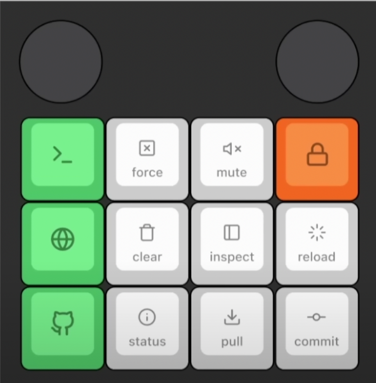

# Documentation pour l'utilisation du clavier avec la configuration fournie

## Aperçu général

Cette configuration définie pour le clavier propose plusieurs couches et macros pour faciliter et personnaliser votre expérience de frappe.

## Touches spéciales

- `_______` : Une touche transparente. Elle prend la fonction de la touche de la couche précédente.
- `xxxxxxx` : Une touche sans fonction. Si pressée, elle n'effectuera aucune action.

## Macros

- `GIT` : Ouvre GitHub.
- `G_STATUS` : Affiche le statut Git.
- `G_PULL` : Effectue une opération de pull depuis l'origine dans Git.
- `G_COMMIT` : Prépare une opération de commit dans Git.
- `BROWSER` : Ouvre le site ocrism.studio.
- `CLEAR` : Efface le contenu.
- `INSPECT` : Ouvre l'outil d'inspection.
- `HARD_RELOAD` : Effectue un rechargement forcé.
- `TERMINAL` : Ouvre le terminal.
- `FORCE_QUIT` : Force l'arrêt d'une application.
- `MUTE` : Coupe le son.
- `LOCK` : Verrouille le système.

## Touches de commutation de couche

- `TD_LYRS` : Utilisé pour changer de couche. Différents tapotements peuvent avoir différents effets.
- `MIDI_OUT` : Active la sortie MIDI.

## Encoders

Les encodeurs rotatifs peuvent être configurés pour effectuer différentes actions en fonction de leur rotation.

## Utilisation

Pour utiliser ce clavier avec la configuration fournie, connectez-le à votre ordinateur et utilisez les touches et macros définies ci-dessus pour effectuer diverses actions. Pour tirer le meilleur parti de votre clavier, familiarisez-vous avec les différentes couches et macros disponibles.

> Pour passer d'une couche à une autre, utilisez la touche `TD_LYRS` en tapotant dessus le nombre de fois correspondant à la couche souhaitée.

| Nombre de tapotements | Couche   |
|-----------------------|----------|
| 1                     | Verrou   |
| 2                     | Couche 1 |
| 3                     | Aucune action |
| 4                     | Couche 2 |

| Couche | Touche 1  | Touche 2   | Touche 3 | Touche 4    |
|--------|----------|-----------|---------|------------|
| MACROS | TERMINAL | FORCE_QUIT| MUTE    | TD_LYRS    |
|        | BROWSER  | CLEAR     | INSPECT | HARD_RELOAD|
|        | GIT      | G_STATUS  | G_PULL  | G_COMMIT   |
| RGB CTL| xxxxxxx  | xxxxxxx   | xxxxxxx | xxxxxxx    |
|        | xxxxxxx  | RGB_MODE_SWIRL | RGB_MODE_KNIGHT | RGB_MODE_BREATHE_RAINBOW |
|        | xxxxxxx  | RGB_MODE_PLAIN | RGB_MODE_BREATHE | RGB_MODE_RAINBOW |
| MIDI   | MIDI(30) | MIDI(69)  | MIDI(70)| MIDI_OUT   |
|        | MIDI(67) | MIDI(66)  | MIDI(65)| MIDI(64)   |
|        | MIDI(60) | MIDI(61)  | MIDI(62)| MIDI(63)   |

## Documentation KMK

[Documentation KMK pour configurer les touches](http://kmkfw.io/docs/keycodes/)